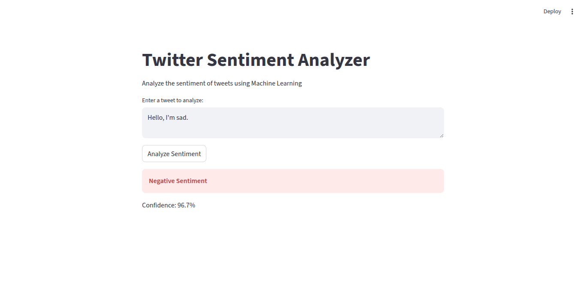

# Twitter Sentiment Analysis

A machine learning project for classifying Twitter tweets as positive or negative sentiment using the Sentiment140 dataset.

## Overview

This project trains a logistic regression model to perform binary sentiment classification on Sentiment140 dataset. The dataset contains 160,000 tweets with balanced positive and negative sentiment labels.

## Project Structure

- `Sentiment.ipynb` - Main Jupyter notebook containing the analysis
- `MP2_Sentiment140.tsv` - Dataset file (Sentiment140)
- `model-ui/` - Streamlit web application for sentiment prediction
  - `app.py` - Main Streamlit application
  - `model/` - Directory containing saved model files

## Workflow

1. **Data Processing and EDA** - Load, clean, and explore the dataset
2. **Feature Selection and Engineering** - Text preprocessing including tokenization, stemming, and TF-IDF vectorization
3. **Model Training and Evaluation** - Train Logistics Regression model and evaluate performance

## Streamlit UI

The project includes a Streamlit web interface for real-time sentiment analysis.

### Screenshots

**Positive Sentiment Prediction:**


**Negative Sentiment Prediction:**



### Running the UI

1. Navigate to the project directory
2. Run the Streamlit app:
   ```bash
   streamlit run model-ui/app.py
   ```
3. Open your browser at `http://localhost:8501`

## Requirements

- Python 3.9.25
- NumPy
- Pandas
- Matplotlib
- Seaborn
- Scikit-learn
- NLTK
- TensorFlow/Keras
- BeautifulSoup4
- WordCloud
- Streamlit
- Joblib

## Usage

1. Install dependencies:

   ```bash
   pip install -r requirements.txt
   ```

2. Open and run the Jupyter notebook:

   ```bash
   jupyter notebook Sentiment.ipynb
   ```

3. Run the Streamlit UI:
   ```bash
   streamlit run model-ui/app.py
   ```

## Author

Usman Bala Usman (contact.usmanusman@gmail.com)
